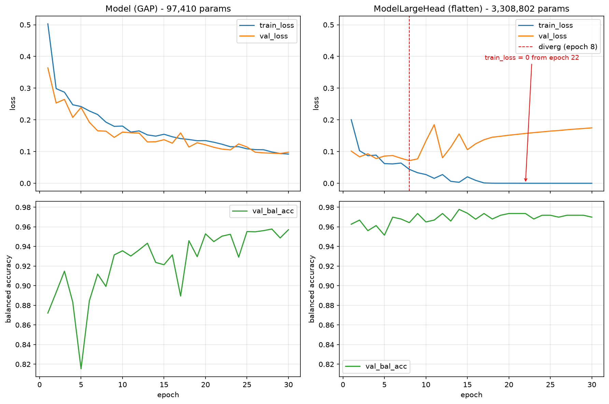

# Chest X-Ray CNN: Pneumonia Classifier

Image classifier for chest X-rays, distinguishing `NORMAL` from `PNEUMONIA`.

## Dataset

[Chest X-Ray Images (Pneumonia)](https://www.kaggle.com/datasets/paultimothymooney/chest-xray-pneumonia). Kaggle, dataset by Paul Mooney.

- ~5,800 pediatric chest X-rays, grayscale
- 2 classes: `NORMAL` / `PNEUMONIA`
- Already split into `train` / `val` / `test`

The dataset is **not included in the repository**. To reproduce it:

1. Download the zip from the dataset's Kaggle page (a Kaggle account is required).
2. Extract it into the `data/` folder, making sure the final structure looks like this:

```
data/
├── train/
│   ├── NORMAL/
│   └── PNEUMONIA/
├── val/
│   ├── NORMAL/
│   └── PNEUMONIA/
└── test/
    ├── NORMAL/
    └── PNEUMONIA/
```

(Note: zip extraction sometimes creates an extra nested folder, check before using the paths in the code.)

---

## Setup

```
python -m venv .venv
.venv\Scripts\activate      # Windows
pip install -r requirements.txt
```

---

## Data inspection

Full analysis in `notebooks/01_exploration.ipynb`, inventory in `experiments/image_inventory.csv`.

| split | NORMAL | PNEUMONIA | share PNEUMONIA |
|---|---|---|---|
| train | 1,341 | 3,875 | 74.3% |
| val | 8 | 8 | 50.0% |
| test | 234 | 390 | 62.5% |

### What makes this dataset harder than it looks

- **The official validation set is unusable**: 16 images. It is rebuilt from the training set.
- **Train and test have different class balance** (74.3% vs 62.5% pneumonia), so the trivial
  classifier scores differently on each split and a model calibrated on train leans towards
  pneumonia at test time.
- **Image resolution alone predicts the class.** NORMAL median width 1,654 vs PNEUMONIA 1,160.
   This difference is so pronounced that it acts almost like a hidden label. Even if all images
   were resized to the same dimensions, the model could still detect the difference through 
   image sharpness or original aspect ratios, and learn to classify based on that rather 
   than the actual pathology.
- **283 images are an externally reprocessed batch**: stored as RGB, all `PNEUMONIA`, all in
  `train`, systematically smaller and more panoramic. The 76 smallest images in the dataset 
  are entirely contained in it.

### Decisions

- **Exclude the reprocessed batch**, rule `mode == "RGB"`, applied to all splits. Costs 7.3% of
  the training pneumonia images. *This removes the contaminated batch, not the resolution
  shortcut.* Raw data is never modified.
- **Convert everything to single channel** (correctness, not optimisation: all 283 RGB files are
  grayscale stored in an RGB container, verified channel-by-channel).
- **Normalise with mean 0.5700 / std 0.1791**, computed on the training split after the resize and
  crop, not on the raw files. Centre-cropping removes the dark borders and raises the mean from 
  0.4825 to 0.5700, while resizing smooths the image and lowers the standard deviation from 0.2383
  to 0.1791.
- **Preserve aspect ratio when resizing** (crop or pad, not a plain squeeze), because aspect ratio
  is class-correlated. Choice between crop and pad still open.
- **Validation split**: drawn from train only, stratified by class *and grouped by patient*, fixed
  seed, saved to disk as a manifest. Grouping is mandatory: 84% of training pneumonia images belong
  to patients that appear more than once.

### Experiment 

`NORMAL` filenames carry no patient identifier, so one was reconstructed from the filename
structure. Visual comparison was inconclusive, so a measurable consequence was tested instead: if
images sharing a key came from the same session, their dimensions should be more similar than
chance. Reshuffling the keys 200 times while preserving group sizes shows the observed value falls
inside the null distribution. So the key captures no coherence beyond chance.

The grouping is kept anyway, since merging two patients only costs flexibility while splitting one
produces leakage, but no claim is made that the validation split is patient-clean on `NORMAL`.

---

## Baselines

Splits after the exclusions above (283 reprocessed files, 32 exact duplicates found by content
hash). The 16 official validation images are marked `ignore` and left out.

| split | NORMAL | PNEUMONIA | total |
|---|---|---|---|
| train | 1,072 | 2,853 | 3,925 |
| val | 268 | 714 | 982 |
| test | 231 | 387 | 618 |

### Choosing the metric

Accuracy is useless here, but the usual replacement does not apply either: the rule of thumb says
to measure the minority class, and the minority class is `NORMAL`, but the clinically critical
one is `PNEUMONIA`, which is also the majority. Recall on pneumonia would therefore be maximised by
the degenerate model that predicts pneumonia for everything.

**Balanced accuracy**: the mean of sensitivity and specificity is used instead. The degenerate
classifier scores exactly 0.500 on every split under it, and unlike macro-F1 it does not depend on
class prevalence, so validation and test figures stay comparable despite their different balance.


### Results

| baseline | validation | test |
|---|---|---|
| trivial (always majority class) | 0.500 | 0.500 |
| logistic regression on metadata, unweighted | 0.791 | 0.756 |
| logistic regression on metadata, class-weighted | **0.860** | 0.801 |

Run log with confusion matrices in `experiments/runs.csv`.

**86% of the task, on validation, is solvable from acquisition metadata alone: image width, height
and aspect ratio. Without opening a single image.** That figure is the quantified version of the
resolution shortcut described above, and it is the context in which every later result has to be
read.

Two things it does not say. It is not a bar a CNN must clear to prove it learned anatomy: a CNN
never sees those numbers, since after resizing every image reaches the network with the same shape,
and the metadata survive only indirectly as resampling sharpness and geometric distortion.

Establishing whether a trained model actually exploits the shortcut needs a separate experiment:
evaluating it on a subset where the two classes are matched by resolution, so that image size
carries no information about the label.

---

## Baseline CNN

`src/model.py`, trained by `src/train.py` (hand-written loop, no high-level framework).

Four blocks of `Conv2d(3x3, padding=1) -> ReLU -> MaxPool(2)`, channels 1 → 16 → 32 → 64 → 128,
then global average pooling and a single `Linear(128, 2)`. Input 224x224, single channel.

**97,410 parameters, of which 99.7% are convolutional.** The classifier head contains only 258 
parameters. Global average pooling removes the spatial dimensions before classification, 
substantially reducing the number of parameters in the classification head compared with 
directly flattening the feature map.

Input size 224×224 was chosen because the pretrained backbones used for the final comparison 
expect that size, keeping the comparison consistent.

Training: batch size 32, Adam at 1e-3, `CrossEntropyLoss`, 30 epochs, seed 42. Grouped validation
split, evaluation on validation only.

### Result

**Best validation balanced accuracy: 0.9578 (epoch 28)**, against 0.860 for the metadata-only
baseline and 0.500 for the trivial one. Per-epoch history in `experiments/history_cnn_baseline_gap.csv`.

### Diagnosis: the expected problem did not occur

|  | epoch 1 | epoch 10 | epoch 20 | epoch 30 |
|---|---|---|---|---|
| train loss | 0.503 | 0.180 | 0.135 | 0.092 |
| val loss | 0.364 | 0.162 | 0.121 | 0.098 |

The two losses fall together and stay within a few thousandths of each other to the end. There is no
overfitting: the validation loss never turns up, and both curves were still descending when training
stopped.

That was not the prediction. The standard heuristic, small dataset, no regularisation, thirty
epochs, expects memorisation. The absence of overfitting is therefore not evidence that the model lacks sufficient capacity to memorise the training set. Rather, the convolutional architecture imposes a strong inductive bias through local connectivity and weight sharing, while global average pooling substantially reduces the dimensionality of the representation passed to the classifier. These choices reduce the model's effective capacity compared with a conventional convolutional network followed by a large fully connected head, but they do not prevent memorisation in principle.

### Controlled comparison: the same network with a dense head



Swapping global average pooling for flatten + dense (97,410 to 3,308,802 parameters, same seed and
same pipeline) produces textbook overfitting: training loss reaches 0.0000 by epoch 22, validation
loss bottoms at epoch 8 and rises from there. Balanced accuracy does not follow,it stays around
0.97 throughout.
